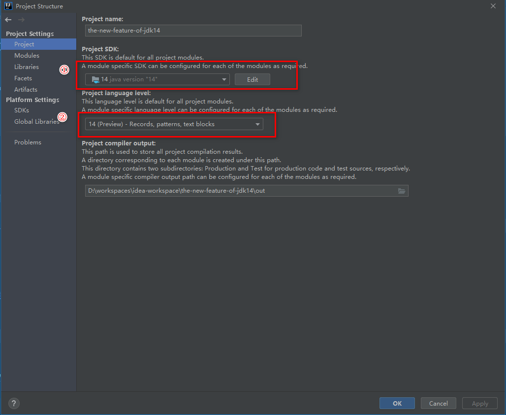
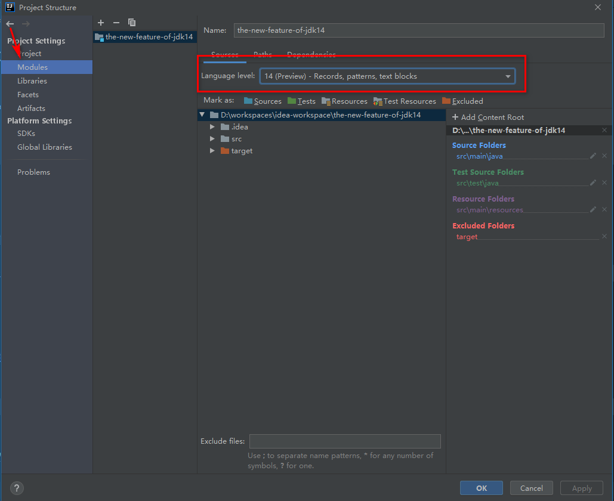

# JDK14新特性之instanceof的模式匹配

## 1. 背景及动机

通过对instanceof运算符进行模式匹配来增强Java编程语言。模式匹配允许程序中的通用逻辑，即从对象中有条件地提取组件，可以更简洁，更安全地表示。这是JDK 14中的预览语言功能。

**动机**

几乎每个程序都包含某种逻辑，这些逻辑结合了对表达式是否具有某种类型或结构的测试，然后有条件地提取其状态的组件以进行进一步处理。例如，所有Java程序员都熟悉实例化。经常见到如下代码：

```java
if (obj instanceof String) {
    String s = (String) obj;
    // use s
}
```

这里发生了三件事：

- 一个测试（obj是一个String吗？）
- 一个转换（将obj转换为String）以及
- 一个新的局部变量的声明，以便我们可以使用字符串值。

这种模式很简单，并且所有Java程序员都可以理解，但是由于一些原因，它不是最优的。这很乏味；不需要进行类型测试和类型转换（在一个testof实例之后还要做什么？）。这个样板-尤其是String类型的三个出现-混淆了后面的更重要的逻辑。但最重要的是，重复为错误提供了机会，使错误不被察觉到程序中。


我们认为Java是时候增强模式匹配了，而不是寻求即席解决方案。模式匹配允许简洁地表达对象的所需`形状`（模式），并允许各种语句和表达式针对其输入来测试`形状`（匹配）。从Haskell到C＃，许多语言都出于其简洁性和安全性而接受了模式匹配。


## 2. 示例

```java
public class InstanceofDemo
{
	public static void main(String[] args) {
		Object obj = "hello java";
//		Object obj = 2345;
		instanceTest(obj);
	}

	public static void instanceTest(Object obj)
	{
		if (obj instanceof String s)
		{
			System.out.println(String.format("字符串：%s", s));
		}
		else if (obj instanceof Integer i)
		{
			System.out.println(String.format("整数：%s", i));
		}
		else {
			throw new RuntimeException("obj的类型无法处理。");
		}
	}
}
```

新的运行逻辑：

新在`instanceof`的类型之后添加了变量`s`。

如果`instanceof`对`obj`的类型检查通过: `obj`是`String`类型时，会被转换成`String`类型的变量`s`。`obj`是`Integer`类型时，会被转换成`Integer`类型的变量`i`。如果判断不成立的话，**无法**在下面的花括号中使用其对应声明的**局部变量**。


## 3. 其他

由于`instanceof`的模式匹配是预览功能，需要通过选项`--enable-preview --source 14`来启用。

```
java --enable-preview --source 14 com/test/InstanceofDemo.java
```

如果使用的IDEA 2020年以后的版本，配置如下即可使用。






